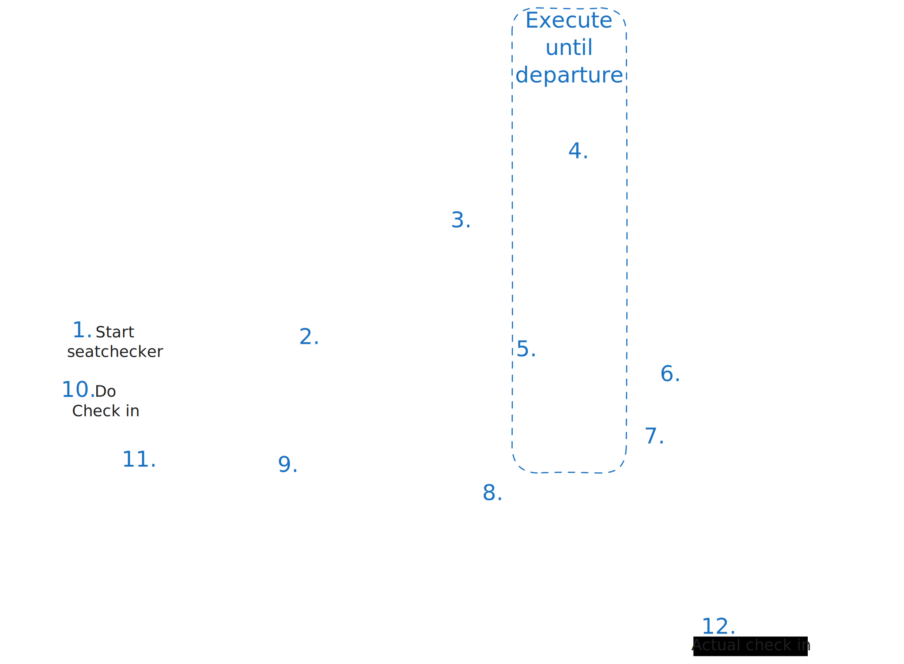

# seatchecker

[Dagger](https://dagger.cloud/Cupprum/traces)

### Functionality of this project:
Query Ryanair to check number of empty Window, Middle and Aisle seats on upcomming flight.

The random algorithm Ryanair uses for seat allocation, probably is not completely random. From my experience, it prefers giving out Middle seats to people who check in sooner. This is probably not a coinsidence. 
Random allocation means no sale for Ryanair, so if they are not making money on you, at least they want to loose as little money as possible.

If people receive a bad seats, there is a chance they will pay extra for a Windows/Aisle seat.

This API starts an AWS Step Function, which regularly sends notifications to [ntfy.sh](https://ntfy.sh) so the user can check in for their flight when all the Middle seats are already in use and therefore receive a Windows/Aisle seat.

### The real purpose of this project:
Sam wanted to play around with new shiny things and was missing Golang.

### Chart

